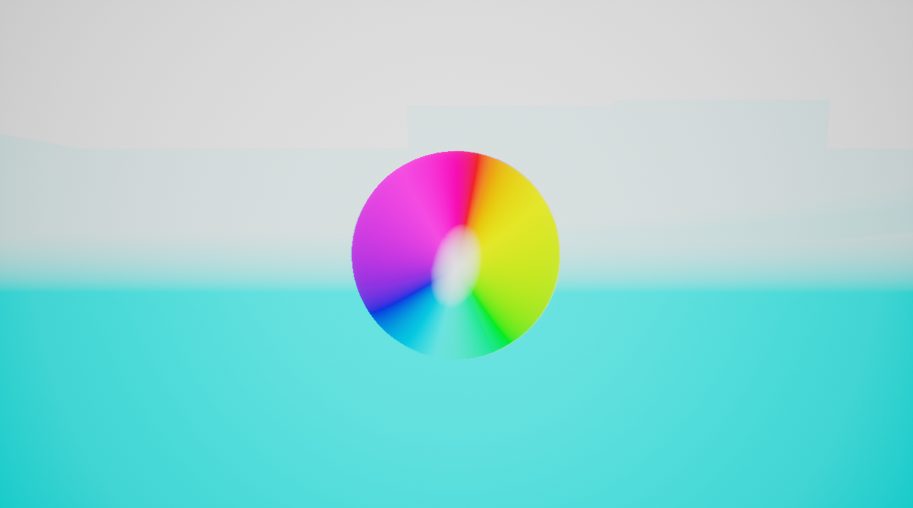
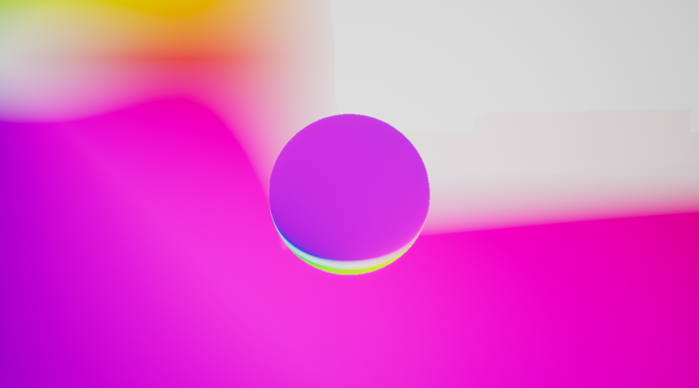

# OptiFlow plugin for UE4
This plugin provides the means to extract optical flow data from Unreal Engine. It is based on [ProfFan's optical flow demo](https://github.com/ProfFan/UnrealOpticalFlowDemo).

# Usage
Currently this plugin requires a patched custom-built Unreal Engine 4. Tested for versions 4.20 and 4.21.

You would need to get UE4 source code, apply `OptiFlowUE4.patch` and then compile the engine. To apply the patch, simply put `OptiFlowUE4.patch` into the root directory of the engine and run `patch -p1 UE4.patch`.

After compiling UE4, use it to create a new project or open an existing one, and then copy [`OptiFlow` directory](https://github.com/BrainsGarden/OptiFlow/tree/master/OptiFlow) into `Plugins` directory (you may need to create it in the root of the project).

After that, you can use [`OptiFlow/Content/PostProcess/VelocityMaterial.uasset
`](https://github.com/BrainsGarden/OptiFlow/blob/master/OptiFlow/Content/PostProcess/VelocityMaterial.uasset) as a post process material. It has two parameters: `VelocityBufferCoefficient` and `StaticObjectCoefficient`, which control how quickly movement saturates colors for stationary/movable and static objects respectively.

# Usability
Currently this plugin correctly displays optical flow data for movable and stationary UE4 actors, based on velocity frame buffer (also used by engine for motion blur). Static actors' optical flow may be estimated incorrectly.

# Examples

Images below are taken using `VelocityMaterial` as a post processing material with `VelocityBufferCoefficient` set to 100, and `StaticObjectCoefficient` set to 20 (this is more than default to emphasize the effect). They are taken using UE4's default "Rolling Blueprint" example, which features a controllable rolling ball with camera attached to it. In our example, a camera is closer to the ball than default.

This image is taken by capturing a ball rolling to the right:

This image is taken by capturing a ball rolling forward along the wall to the left:

